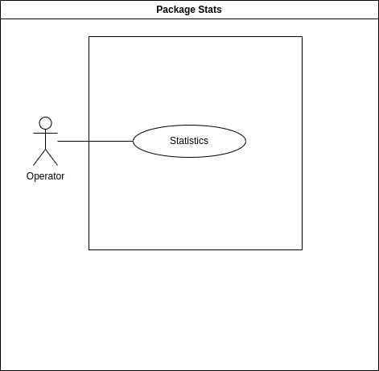

# ProgettoProgrammazioneAvanzata

Project for the Programmazione Avanzata course - UnivPM 2023/2024

## Table of Contents

- [ProgettoProgrammazioneAvanzata](#progettoprogrammazioneavanzata)
	- [Table of Contents](#table-of-contents)
	- [🗂️ Project specification and goals](#️-project-specification-and-goals)
	- [🕹️ Technologies Used](#️-technologies-used)
	- [📊 UML diagrams](#-uml-diagrams)
		- [💼 UML Use-case diagrams](#-uml-use-case-diagrams)
			- [UML Actors](#uml-actors)
			- [UML Use-case Gate](#uml-use-case-gate)
			- [UML Use-case Section](#uml-use-case-section)
			- [UML Use-case Transit](#uml-use-case-transit)
			- [UML Use-case Ticket](#uml-use-case-ticket)
			- [UML Use-case Stats](#uml-use-case-stats)
		- [⌛ UML Sequence Diagram](#-uml-sequence-diagram)
			- [UML CRUD Gate](#uml-crud-gate)
			- [UML findGate](#uml-findgate)
			- [UML CRUD Transit](#uml-crud-transit)
			- [UML errorTransit](#uml-errortransit)
			- [UML sdTickets](#uml-sdtickets)
	- [🧮 Patterns used](#-patterns-used)
		- [Model-Controller](#model-controller)
		- [Singleton](#singleton)
		- [DAO](#dao)
		- [Chain of Responsibility](#chain-of-responsibility)
	- [🦽 Routes](#-routes)
		- [Route /users](#route-users)
			- [Route GET: /users](#route-get-users)
			- [Route GET: /users/:username](#route-get-usersusername)
			- [Route POST: /users](#route-post-users)
			- [Route PUT: /users/:username](#route-put-usersusername)
			- [Route DELETE: /users/:username](#route-delete-usersusername)
		- [Routes /vehicles](#routes-vehicles)
			- [Route GET: /vehicles](#route-get-vehicles)
			- [Route GET: /vehicles/:type](#route-get-vehiclestype)
			- [Route POST: /vehicles](#route-post-vehicles)
			- [Route PUT: /vehicles/:type](#route-put-vehiclestype)
			- [Route DELETE: /vehicles/:type](#route-delete-vehiclestype)
		- [Routes /gates](#routes-gates)
			- [Route GET: /gates](#route-get-gates)
			- [Route GET: /gates/:id](#route-get-gatesid)
			- [Route POST: /gates](#route-post-gates)
			- [Route PUT: /gates/:id](#route-put-gatesid)
			- [Route DELETE: /gates/:id](#route-delete-gatesid)
		- [Routes /sections](#routes-sections)
			- [Route GET: /sections](#route-get-sections)
			- [Route GET: /sections/:id](#route-get-sectionsid)
			- [Route POST: /sections](#route-post-sections)
			- [Route PUT: /sections/:id](#route-put-sectionsid)
			- [Route DELETE: /sections/:id](#route-delete-sectionsid)
		- [Routes /transits](#routes-transits)
			- [Route GET: /transits](#route-get-transits)
			- [Route GET: /transits/:id](#route-get-transitsid)
			- [Route GET: /notFoundTransits](#route-get-notfoundtransits)
			- [Route POST: /transits](#route-post-transits)
			- [Route PUT: /transits/:id](#route-put-transitsid)
			- [Route DELETE: /transits/:id](#route-delete-transitsid)
		- [Routes /tickets](#routes-tickets)
			- [Route GET: /tickets](#route-get-tickets)
			- [Route POST: /tickets](#route-post-tickets)
		- [Routes /stats](#routes-stats)
			- [Route get: /stats/:method](#route-get-statsmethod)
	- [🧭 Routes](#-routes-1)
	- [🔧 How to use the project](#-how-to-use-the-project)
	- [💻 Test](#-test)
		- [Users](#users)
			- [GET **/users**](#get-users)
				- [RESPONSE](#response)
			- [GET **/users/:username**](#get-usersusername)
				- [PARAMS](#params)
				- [RESPONSE](#response-1)
			- [POST **/users**](#post-users)
				- [BODY](#body)
				- [RESPONSE](#response-2)
			- [PUT **/users/:username**](#put-usersusername)
				- [PARAMS](#params-1)
				- [BODY](#body-1)
				- [RESPONSE](#response-3)
			- [DELETE **/users/:username**](#delete-usersusername)
				- [PARAMS](#params-2)
				- [RESPONSE](#response-4)
		- [Vehicles](#vehicles)
			- [GET **/vehicles**](#get-vehicles)
				- [RESPONSE](#response-5)
			- [GET **/vehicles/:type**](#get-vehiclestype)
				- [PARAMS](#params-3)
				- [RESPONSE](#response-6)
			- [POST **/vehicles**](#post-vehicles)
				- [BODY](#body-2)
				- [RESPONSE](#response-7)
			- [PUT **/vehicles/:type**](#put-vehiclestype)
				- [PARAMS](#params-4)
				- [BODY](#body-3)
				- [RESPONSE](#response-8)
			- [DELETE **/vehicles/:type**](#delete-vehiclestype)
				- [PARAMS](#params-5)
				- [RESPONSE](#response-9)
		- [Gates](#gates)
			- [GET **/gates**](#get-gates)
				- [RESPONSE](#response-10)
			- [GET **/gates/:id**](#get-gatesid)
				- [PARAMS](#params-6)
				- [RESPONSE](#response-11)
			- [POST **/gates**](#post-gates)
				- [BODY](#body-4)
				- [RESPONSE](#response-12)
			- [PUT **/gates/:id**](#put-gatesid)
				- [PARAMS](#params-7)
				- [BODY](#body-5)
				- [RESPONSE](#response-13)
			- [DELETE **/gates/:id**](#delete-gatesid)
				- [PARAMS](#params-8)
				- [RESPONSE](#response-14)
		- [Sections](#sections)
			- [GET **/sections**](#get-sections)
				- [RESPONSE](#response-15)
			- [GET **/sactions/:id**](#get-sactionsid)
				- [PARAMS](#params-9)
				- [RESPONSE](#response-16)
			- [POST **/sections**](#post-sections)
				- [BODY](#body-6)
				- [RESPONSE](#response-17)
			- [PUT **/sections/:id**](#put-sectionsid)
				- [PARAMS](#params-10)
				- [BODY](#body-7)
				- [RESPONSE](#response-18)
			- [DELETE **/sections/:id**](#delete-sectionsid)
				- [PARAMS](#params-11)
				- [RESPONSE](#response-19)
		- [Transits](#transits)
			- [GET **/transits**](#get-transits)
				- [RESPONSE](#response-20)
			- [GET **/transits/:id**](#get-transitsid)
				- [PARAMS](#params-12)
				- [RESPONSE](#response-21)
			- [POST **/transits**](#post-transits)
				- [BODY](#body-8)
				- [RESPONSE](#response-22)
			- [GET **/notFoundTransits**](#get-notfoundtransits)
				- [RESPONSE](#response-23)
			- [PUT **/transits/:id**](#put-transitsid)
				- [PARAMS](#params-13)
				- [BODY](#body-9)
				- [RESPONSE](#response-24)
			- [DELETE **/transits/:id**](#delete-transitsid)
				- [PARAMS](#params-14)
				- [RESPONSE](#response-25)
		- [Tickets](#tickets)
			- [GET **/tickets**](#get-tickets)
				- [RESPONSE](#response-26)
			- [POST **/tickets**](#post-tickets)
				- [Case 1](#case-1)
					- [PAYLOAD](#payload)
					- [BODY](#body-10)
					- [RESPONSE](#response-27)
				- [Case 2](#case-2)
					- [PAYLOAD](#payload-1)
					- [BODY](#body-11)
					- [RESPONSE](#response-28)
				- [Case 3](#case-3)
					- [PAYLOAD](#payload-2)
					- [BODY](#body-12)
					- [RESPONSE](#response-29)
		- [Stats](#stats)
			- [POST **/stats/getFrequentSections**](#post-statsgetfrequentsections)
				- [BODY](#body-13)
				- [RESPONSE](#response-30)
			- [POST **/stats/getMinMaxSpeed**](#post-statsgetminmaxspeed)
				- [BODY](#body-14)
				- [RESPONSE](#response-31)
	- [📮 Demo](#-demo)
		- [Settings pre-Demo](#settings-pre-demo)
		- [Demo File](#demo-file)
	- [👯‍♂️ Contributors](#️-contributors)

## 🗂️ Project specification and goals

We have implemented a system to manage a Tutor-type ticket manager. In particular, this application should allow users, authenticated via JWT, to manage and create the entire structure that allows the automatic creation of tickets.

Based on their permissions, users are divided into three roles: operator, gate and driver. The first can access all the routes linked to the system and, specifically, the CRUD (Create, Read, Update and Delete) functions of the gates, sections and transits. The second can only perform transit creation operations. Finally, the latter will only be able to view the tickets linked to the license plates of his vehicles.

The system, through the data provided by users with the role of operator and gate, allows the automatic calculation of the average speed of the vehicle. This operation is carried out based on the recorded transits. For this reason, a list of limits has also been implemented for each type of vehicle, which are further lowered in case of bad weather, in order to dynamically calculate whether the average speed of the vehicle is above or below the limit. Based on this the system creates the ticket.

The operator, through the system, can filter the list of all tickets, by time slot, in order to know the section that contains the most tickets and which tickets have the highest and lowest average speed.

Finally, every User has a Token that decrease every time he exeute an authorized operation. When this Token reach 0 the system throw a costum error and reset the User's Token.

## 🕹️ Technologies Used

- [Visual Studio Code](https://code.visualstudio.com/)
- [Docker](https://www.docker.com/)
- [Node.js](https://nodejs.org/en)
- [PostgreSQL](https://www.postgresql.org/)
- [Express](https://expressjs.com/it/)
- [Sequelize](https://sequelize.org/)
- [Postman](https://www.postman.com/)

## 📊 UML diagrams

### 💼 UML Use-case diagrams

#### UML Actors


The actors are:

- User
  - Operator
  - Gate
  - Driver
- System

Through a generalization we managed the user by distinguishing them based on their role (operator, gate and driver).

The system actor is reported because the generation of fines occurs automatically.

#### UML Use-case Gate


This diagram shows User interaction with the Operator role. This role allows the User to perform Gate CRUD operations: Create, Read, Update and Delete.

In particular the included use case **<b>"Find Gate"</b>** is necessary for all operations shown.

#### UML Use-case Section


This diagram shows User interaction with the Operator role. This role allows the User to perform Section CRUD operations: Create, Read, Update and Delete.

In particular the included use case **<b>"Find Section"</b>** is necessary for all operations shown.

#### UML Use-case Transit


This diagram shows User interaction with the Operator and Gate role. This first one allows the User to perform Transit CRUD operations: Create, Read, Update and Delete. The second one, instead, allows the User to perform **<b>only</b>** Create Transit.

In particular the included use case **<b>"Find Transit"</b>** is necessary for all operations shown.

#### UML Use-case Ticket


This diagram shows User interaction with the Operator and Driver roles. The first one allows the User to view all fines. The second one allows the User to know only the tickets linked to the license plates of their vehicles.

The System is the only one that can manage the automatic creation of the tickets.

#### UML Use-case Stats



This diagram shows User interaction with the Operator role. This role allows the User to filter tickets in order to obtain statistics for sections with the highest number of tickets or to display the tickets with the maximum and minimum average speed.

### ⌛ UML Sequence Diagram

#### UML CRUD Gate


This sequence diagram shows all the CRUD operations that can be performed by the user with the operator role: Create, Read, Update, Delete.

The findGate sequence diagram has been recalled as **<b>ref</b>** within the diagram because it is necessary for the correct execution of CRUD operations.

#### UML findGate


This sequence diagram allows the user with the role operator to search for a specific Gate instance.

#### UML CRUD Transit


This sequence diagram shows all the CRUD operations that can be performed by the user with the operator role: Create, Read, Update, Delete. Instead, the user with the role gate can **<b>only</b>** Create transits.

The findTransit sequence diagram has been recalled as **<b>ref</b>** within the diagram because it is necessary for the correct execution of CRUD operations.

**<mark>All the others CRUD for Section, Vehicle are similar to the ones already described. For this reason we omitted them</mark>**

#### UML errorTransit


This sequence diagram shows that the user with the operator role can find and correct all the instances of Transit that are not corrected (the plate of the vehicle is **<b>"notFound"</b>**).

The findTransit sequence diagram has been recalled as **<b>ref</b>** within the diagram because it is necessary for the correct execution of the operation.

#### UML sdTickets


This sequence diagram shows the actions that the system and the user with the operator and driver roles can perform. The system creates the ticket automatically. The user with the operator role can view all the tickets while with the driver role he can only view the tickets that belong to the registered license plates of his vehicles.

The findData sequence diagram has been recalled as **<b>ref</b>** within the diagram because it is necessary for the correct execution of the showed operations.

## 🧮 Patterns used

### Model-Controller

In our project, we employ the Model-Controller (or Model-View-Controller, MVC) pattern to structure the application, ensuring a clear separation of concerns between data management (Model) and business logic (Controller).

There isn't a View because we have deployed only the back-end because the front-end wasn't necessary. For this reason all the requests are made using Postman.

### Singleton

The Singleton is a creational design pattern that guarantees that there is only one instance of a class and provides a global access point to that instance.

In our design, the DBIsConnected class ensure through his method that the connection is established only once.

### DAO

The DAO (Data Access Object) pattern is a design pattern that separates data access logic from business logic within an application. 

The DAO allows you to separate business logic from data manipulation by isolating operations in classes and abstracting database data into models.

In our project, the DAO pattern was used to manage data access and manipulation within the PostgreSQL database through the Sequelize ORM in the Node.js environment.

Database queries are carried out thanks to functions made available by Sequelize such as **<i>"findAll(), findByPK(), ..."</i>**

### Chain of Responsibility

The Chain of Responsibility is a behavioral design pattern that allows you to pass requests along a chain of handlers. 

Each handler in the chain has the ability to process the request or pass it on to the next handler in the chain. This pattern decouples the sender of a request from its receiver, giving multiple objects a chance to handle the request.

In our project, the Chain of Responsibility model is implemented using middleware functions organized in customized pipelines and passed to each route to manage the validation, authentication and authorization mechanism of each of them.

## 🦽 Routes

### Routes /users

All of this routes handle the CRUD operation for Users. Users with the Operator, Gate and Driver role already exists in **<b>ticket_db</b>** thanks to their seed.

#### Route GET: /users 

This route doesn't require authentication and shows all the existing Users.

#### Route GET: /users/:username

This route can only be used by an User with role operator (JWT Token Required). By typing an existing username of a User in the **<mark>param</mark>** of the request in postman it shows his data (**<i>Username, Role, Token</i>**) in the table Users.

#### Route POST: /users

This route can only be used by an User with role operator (JWT Token Required). By typing in the **<mark>body</mark>** of the request in postman the data of the new User (**<i>Username</i>**) the system creates him. Can only be created Users with gate role.

Here an example of the body:

```
{
  "username": "User4"
}
```

#### Route PUT: /users/:username

This route can only be used by an User with role operator (JWT Token Required). By typing in the 
**<mark>param</mark>** the current User's username and in  the **<mark>body</mark>** of the request in postman the new data of the User (**<i>Username</i>**) the system updates him.

Here an example of the body:

```
{
  "newUsername" : "operator123"
}
```
**<mark>If the username of the User with the role operator is updated it must be changed in the authentication payload with the new one. Here an example of the payload:</mark>**

```
{
  "username" : "operator123",
  "role" : "operator"
}
```

#### Route DELETE: /users/:username

This route can only be used by an User with role operator (JWT Token Required). By typing in the 
**<mark>param</mark>** an existing User's username of the request in postman the system deletes him.

### Routes /vehicles

All of this routes handle the CRUD operation for Vehicles. Some instances alreay exists in the DB **<b>ticket_db</b>** thanks to the seed.

#### Route GET: /vehicles

This route can only be used by an User with role operator (JWT Token Required) and shows all the existing Vechicles.

#### Route GET: /vehicles/:type

This route can only be used by an User with role operator (JWT Token Required). By typing an existing username of a User in the **<mark>param</mark>** of the request in postman it shows his data (**<i>Type, Limit</i>**) in the table Vehicles.

#### Route POST: /vehicles

This route can only be used by an User with role operator (JWT Token Required). By typing in the **<mark>body</mark>** of the request in postman the data of the new Vehicles (**<i>Type, Limit</i>**) the system creates it.

Here an example of the body:

```
{
  "type":"bike",
  "limit": 65
}
```

#### Route PUT: /vehicles/:type

This route can only be used by an User with role operator (JWT Token Required). By typing in the 
**<mark>param</mark>** the current Vehicles's type and in  the **<mark>body</mark>** of the request in postman the new data of the User (**<i>Limit</i>**) the system updates it.

Here an example of the body:

```
{
  "newLimit": 32
}
```

**<mark>limit and newLimit must be an Integer between 30 and 150</mark>**

#### Route DELETE: /vehicles/:type

This route can only be used by an User with role operator (JWT Token Required). By typing in the 
**<mark>param</mark>** an existing Vehicle's type of the request in postman the system deletes it.

### Routes /gates

All of this routes handle the CRUD operation for the Location of the User with the role Gate. Some instances alreay exists in the DB **<b>ticket_db</b>** thanks to the seed.

**<mark>This Gate Table is linked to the User Table through the Foreign Key username and his only porpuse is to storage the Location of the Gates. Only Users with the role Gate can exist in this Table.</mark>**

#### Route GET: /gates

This route can only be used by an User with role operator (JWT Token Required) and shows all the existing Gates.

#### Route GET: /gates/:id

This route can only be used by an User with role operator (JWT Token Required). By typing an existing id of a Gate in the **<mark>param</mark>** of the request in postman it shows his data (**<i>Username, Location</i>**) in the table Gates.

#### Route POST: /gates

This route can only be used by an User with role operator (JWT Token Required). By typing in the **<mark>body</mark>** of the request in postman the data of the new Gates (**<i>Username, Location</i>**) the system creates him.

This creation is successfully done only when the **<i>username</i>** in the **<mark>body</mark>** already exists in the User Table with the role Gate.

Here an example of the body:

```
{
  "location": "LAT56.494887LON21.342644",
  "username": "gate"
}
```

#### Route PUT: /gates/:id

This route can only be used by an User with role operator (JWT Token Required). By typing in the 
**<mark>param</mark>** the current Gates's id and in  the **<mark>body</mark>** of the request in postman the new data of the User (**<i>Username</i>**) the system updates it.

Here an example of the body:

```
{
  "newUsername": "gate"
}
```

**<mark>The Location cannot be updated because it's used in all the others Tables, expect for Users and Vehicles, and if it is changed it will be created a loss of data. For this reason if the Location is not corrected when created it must be deleted its istance in the Gate Table</mark>**

#### Route DELETE: /gates/:id

This route can only be used by an User with role operator (JWT Token Required). By typing in the 
**<mark>param</mark>** an existing Gate's id of the request in postman the system deletes it.

### Routes /sections

All of this routes handle the CRUD operation for the Sections. Some instances alreay exists in the DB **<b>ticket_db</b>** thanks to the seed.

**<mark>This Sections Table is linked to the Gate Table through the Foreign Key id (id Gate) and his porpuse is to storage the distance between two gates. Only Users with the role Operator can operate on this Table.</mark>**

#### Route GET: /sections

This route can only be used by an User with role operator (JWT Token Required) and shows all the existing Sections.

#### Route GET: /sections/:id

This route can only be used by an User with role operator (JWT Token Required). By typing an existing id of a Section in the **<mark>param</mark>** of the request in postman it shows its data (**<i>InitialGate, FinalGate, Distance</i>**) in the table Sections.

#### Route POST: /sections

This route can only be used by an User with role operator (JWT Token Required). By typing in the **<mark>body</mark>** of the request in postman the data of the new Sections (**<i>finalGate, InitialGate, Distance</i>**) the system creates him.

The distance is automatically calculated by the system using the locations (Cordinates) of the initialGate and finalGate in the Gates Table.

This creation is successfully done only when the **<i>initialGate and finalGate</i>** in the **<mark>body</mark>** already exists as Id in the Gates Table.

Here an example of the body:

```
{
  "initialGate" : 2,
  "finalGate" : 1
}
```

#### Route PUT: /sections/:id

This route can only be used by an User with role operator (JWT Token Required). By typing in the 
**<mark>param</mark>** the current Section's id and in the **<mark>body</mark>** of the request in postman the new data of the Section (**<i>InitalGate, FinalGate</i>**) the system updates it.

The distance is automatically calculated by the system using the locations (Cordinates) of the initialGate and finalGate in the Gates Table.

This update is successfully done only when the **<i>initialGate and finalGate</i>** in the **<mark>body</mark>** already exists as Id in the Gates Table.

Here an example of the body:

```
{
  "newInitialGate" : 1,
  "newFinalGate" : 2
}
```

#### Route DELETE: /sections/:id

This route can only be used by an User with role operator (JWT Token Required). By typing in the 
**<mark>param</mark>** an existing Section's id of the request in postman the system deletes it.

### Routes /transits

All of this routes handle the CRUD operation for the Transits. Some of them alreay exists in the DB **<b>ticket_db</b>** thanks to the seed.

**<mark>This Transits Table is linked to the Gate Table through the Foreign Key gate (Id Gate) and to the Vehicles Table through the Foreign Key vehicles_types (Type Vehicle). His porpuse is to storage the passage of a vehicle in a Gate. Only Users with the role Operator and Gate can operate on this Table.</mark>**

#### Route GET: /transits

This route can only be used by an User with role operator (JWT Token Required) and shows all the existing Transits.

#### Route GET: /transits/:id

This route can only be used by an User with role operator (JWT Token Required). By typing an existing id of a Transit in the **<mark>param</mark>** of the request in postman it shows its data (**<i>plate, transit_date, speed, weather, vehicles_types, gate, used</i>**) in the table Sections:

- plate: plate of the vehicle tha passed through the Gate. In the only case that the plate is non recognized it must be set as **<i>"notFound"</i>** in the creation ad updating routes.
- transit_date: the Date automatically created when the DB saves the new instance;
- speed: speed of the vehicle in that moment;
- weather: climate condition in that moment. Can only be **<i>good weather or bad weather</i>**; 
- gate: the Id of the Gate the vehicle passed through.
- used: a boolean variable that is **<i>false</i>** when the transits isn't used in a tickets and **<i>true</i>** when it is.

#### Route GET: /notFoundTransits

This route can only be used by an User with role operator (JWT Token Required) and shows all the existing Transits with a **<i>"notFound"</i>** plate.

#### Route POST: /transits

This route can only be used by an User with role operator or gate (JWT Token Required). By typing in the **<mark>body</mark>** of the request in postman the data of the new Transits (**<i>plate, speed, weather, vehicles_types, gate</i>**) the system creates him.

The transit_date is automatically calculated by the system during the creation.

This creation is successfully done only when all the variables respect the Foreign Keys.

Here an example of the body:

```
{
  "plate": "notFound",
  "speed": 45,
  "weather": "bad weather",
  "vehicles_types": "Truck",
  "gate": 1
}
```

#### Route PUT: /transits/:id

This route can only be used by an User with role operator (JWT Token Required). By typing in the 
**<mark>param</mark>** the current Transits's id and in the **<mark>body</mark>** of the request in postman the new data of the Transit (**<i>plate, speed, weather, vehicles_types, gate</i>**) the system updates it.

The transit_date is automatically calculated by the system during the update.

This creation is successfully done only when all the variables respect the Foreign Keys.

Here an example of the body:

```
{
  "newPlate": "XZ456EX",
  "newSpeed": 700,
  "newWeather": "bad weather",
  "newVehicles_types": "Truck",
  "newGate": 1
}
```

#### Route DELETE: /transits/:id

This route can only be used by an User with role operator (JWT Token Required). By typing in the 
**<mark>param</mark>** an existing Transits's id of the request in postman the system deletes it.

### Routes /tickets

All of this routes handle the operations for the tickets. Some of them alreay exists in the DB **<b>ticket_db</b>** thanks to the seed.

**<mark>This Tickets Table is linked to the Sections Table through the Foreign Key initialGate and finalGate (Id Gate). His porpuse is to storage the passage of a vehicle in a Gate. Only Users with the role Operator and Gate can operate on this Table.</mark>**

#### Route GET: /tickets

This route can only be used by an User with role operator (JWT Token Required) and shows all the existing Tickets.

#### Route POST: /tickets

This route can only be used by an User with role operator or driver (JWT Token Required). By typing in the **<mark>body</mark>** of the request in postman the data of the existing Tickets (**<i>plates, startDate, endDate, format</i>**) the system shows them all:

- plates: A list of plates that the User want to check if they have any Tickets. **<mark>Users with the role operator can see every Tickest of any Plates. On the other hand, Users with the role driver, can only see the Tickets of their own Plates. The link between Users with the role Driver and their Plates is in the Plates Table (Seeded with the seeder).>** **<i>For this reason choose the payload carefully;</i>**
- startDate and endDate: it is a time filter that ensure that the only Tickets shown were created by the system between this dates;
- format: this variable gives the oppurtunity to choose the output format of the Postam Response. Can only be **<i>json</i>** or **<i>pdf</i>**.

Here an example of the body:

```
{
  "plates": "YX987ZT, AB123CD, XZ456EX",
  "startDate": "2023-07-01T14:00:00",
  "endDate": "2025-07-07T16:30:00",
  "format" : "pdf"
}
```

### Routes /stats

#### Route get: /stats/:method

This route can only be used by an User with role operator (JWT Token Required). If the **<mark>param</mark>** is **<remark>getFrequentSections</remark>** the application shows the Sections with the most Tickets. Else, if the **<mark>param</mark>** is **<remark>getMinMaxSpeed</remark>** the application shows the Tickets with the maximum and minimum vehicle speed.

By typing in the **<mark>body</mark>** of the request in postman the time filter for the Stats (**<i>startDate and endDate</i>**) the system shows only the istance of the Table Tickets created between this dates.

**<mark>If there isn't the body of the request the system filter all the istances in the Tickets Table</mark>**

Here an example of the body:

```
{
    "startDate" : "2023-07-09T10:06:02",
    "endDate" : "2025-07-09T10:06:02"
}
```

## 🧭 Routes

| Route            | Method | Description                                       | JWT Authentication |
| ---------------- | ------ | ------------------------------------------------- | ------------------ |
| /users           | GET    | Retrieve al Users                                 | No                 |
| /users/:username | GET    | Retrieve a single user                            | Yes                |
| /users           | POST   | Make a new User with role Gate                    | Yes                |
| /users/:username | PUT    | Update a single User                              | Yes                |
| /users/:username | DELETE | Delete a single User                              | Yes                |
| /vehicles        | GET    | Get all the Vehicles                              | Yes                |
| /vehicles/:type  | GET    | Retrieve a single Vehicle                         | Yes                |
| /vehicles        | POST   | Create a new Vehicle                              | Yes                |
| /vehicles/:type  | PUT    | Update a single Vehicle                           | Yes                |
| /vehicles/:type  | DELETE | Delete a single Vehicle                           | Yes                |
| /gates           | GET    | Get all the Gates                                 | Yes                |
| /gates/:id       | GET    | Retrieve a single Gate                            | Yes                |
| /gates           | POST   | Create a new Gate                                 | Yes                |
| /gates/:id       | PUT    | Update a single Gate                              | Yes                |
| /gates/:id       | DELETE | Delete a single Gate                              | Yes                |
| /sections        | GET    | Get all the Sections                              | Yes                |
| /sections/:id    | Get    | Retrieve a single Section                         | Yes                |
| /sections        | POST   | Create a new Section                              | Yes                |
| /sections/:id    | PUT    | Update a single Section                           | Yes                |
| /sections/:id    | DELETE | Delete a single Section                           | Yes                |
| /transits        | GET    | Get all the Transits                              | Yes                |
| /transits/:id    | GET    | Retrieve a single Transit                         | Yes                |
| /notFoundTransits    | GET    | Get all Transits with Plate **<i>"notFound"</i>**                         | Yes                |
| /transits        | POST   | Create a new Transit                              | Yes                |
| /transits/:id    | PUT    | Update a single Transit                           | Yes                |
| /transits/:id    | DELETE | Delete a single Transit                           | Yes                |
| /tickets         | GET    | Get all the Tickets                               | Yes                |
| /tickets         | POST   | Retrieve filterd Tickets by Plate and Time        | Yes                |
| /stats/:method   | GET    | Retrieve all the filtered Stats by param and body | Yes                |

## 🔧 How to use the project

To use the project, you need to have [Docker](https://www.docker.com/) installed and running on your device.
Secondly, you need to clone this GitHub repository:

```
[git clone https://github.com/GabrielPiercecchi/ProgettoProgrammazioneAvanzata
```

After coping the project, you need to place a **<mark>.env</mark>** file inside the project directory. Here are the required fields with example parameters:

```
SERVICE_HOST=3000
SERVICE_PORT=3000
POSTGRES_USER=admin
POSTGRES_PASSWORD=admin
POSTGRES_DB=ticket_db
POSTGRES_PORT=5432
POSTGRES_HOST=postgres
NODE_ENV=production
PRIVATE_KEY=""
```

`POSTGRES_HOST=postgres` is the name of the Postgres container and should be left as is.

In this file, you also need to include the private key and paste it between the double quotes of `PRIVATE_KEY`, which can be generated by tools such as OpenSSL, using the RS256 algorithm.
The command line to do so is:

```
openssl genrsa -out key.pem 2048
```

This same private key will need to be used to generate the JWT tokens that allow for actual usage of this program.

Once these steps are completed, you can proceed with running the project.

Now you'll need to generate the Docker image for the application using the following command:

```
docker-compose build
```

Start the Docker Compose consisting of the application container and the PostgreSQL container with this command:

```
docker-compose up
```

When both the containers are up and running, you must enter the `backendTutor` container's shell with the following command:

```
docker exec -it backendTutor bash
```

In the container you have to run Sequelize migrations and seeders, otherwise the program won't work correctly:

```
sequelize db:migrate

sequelize db:seed:all
```

This will create and seed all the Tables you need.This commands will give you acces to 5 default users:

- "operator": an User with the operator role with 10 Token left;
- "gate": an User with the gate role with 10 Token left;
- "gate1": an User with the gate role with 10 Token left;
- "gate2": an User with the gate role with 10 Token left;
- "driver": an User with the driveer role with 10 Token left;

**<mark>Every time the Token runs out it will be restored to 10 after a custom error message:</mark>**

```
{
  "message": "Unauthorized. Token remained:0",
  "token": 10
}
```

Once everything is set up, you can proceed to make requests using [Postman](https://www.postman.com/).

## 💻 Test

In all routes that require authorization, the JWT payload should include the following fields:

```
{
  "username": "username",
  "role": "role",
}
```
With `operator` as `username` and  `operator` as  `role` you should be able to do anything.

After that we can go on to test all the routes.
Each request made to a route should include a JSON-formatted payload in its body.

**<i>Because there are many routes it will be reported only one test for each</i>**

### Users

#### GET **<mark>/users</mark>**

##### RESPONSE

```
[
  {
      "username": "operator",
      "role": "operator",
      "token": 10
  },
  {
      "username": "gate",
      "role": "gate",
      "token": 10
  },
  {
      "username": "gate1",
      "role": "gate",
      "token": 10
  },
  {
      "username": "gate2",
      "role": "gate",
      "token": 10
  },
  {
      "username": "driver",
      "role": "driver",
      "token": 10
  }
]
```

#### GET **<mark>/users/:username</mark>**

##### PARAMS

```
operator
```

##### RESPONSE

```
{
  "username": "operator",
  "role": "operator",
  "token": 9
}
```

#### POST **<mark>/users</mark>**

##### BODY

```
{
  "username": "gate3"
}
```

##### RESPONSE

```
{
  "token": 10,
  "username": "gate3",
  "role": "gate"
}
```

#### PUT **<mark>/users/:username</mark>**

##### PARAMS

```
gate3
```

##### BODY

```
{
  "username": "gate34"
}
```

##### RESPONSE

```
{
  "username": "gate34",
  "role": "gate",
  "token": 10
}
```

#### DELETE **<mark>/users/:username</mark>**

##### PARAMS

```
gate34
```

##### RESPONSE

```
"User with this username deleted successfully: gate34"
```

### Vehicles

#### GET **<mark>/vehicles</mark>**

##### RESPONSE

```
[
  {
      "type": "Car",
      "limit": 150
  },
  {
      "type": "Truck",
      "limit": 90
  },
  {
      "type": "Motorcycle",
      "limit": 120
  }
]
```

#### GET **<mark>/vehicles/:type</mark>**

##### PARAMS

```
car
```

##### RESPONSE

```
{
  "type": "Car",
  "limit": 150
}
```

#### POST **<mark>/vehicles</mark>**

##### BODY

```
{
  "type":"bike",
  "limit": 65
}
```

##### RESPONSE

```
{
  "type":"bike",
  "limit": 65
}
```

#### PUT **<mark>/vehicles/:type</mark>**

##### PARAMS

```
bike
```

##### BODY

```
{
  "newLimit" : 30
}
```

##### RESPONSE

```
{
  "type": "bike",
  "limit": 30
}
```

#### DELETE **<mark>/vehicles/:type</mark>**

##### PARAMS

```
bike
```

##### RESPONSE

```
"Vehicle with this type deleted successfully: bike"
```

### Gates

#### GET **<mark>/gates</mark>**

##### RESPONSE

```
[
  {
    "id": 1,
    "location": "LAT43.615829LON13.518915",
    "username": "gate"
  },
  {
    "id": 2,
    "location": "LAT44.494887LON11.342616",
    "username": "gate1"
}
]
```

#### GET **<mark>/gates/:id</mark>**

##### PARAMS

```
1
```

##### RESPONSE

```
{
  "id": 1,
  "location": "LAT43.615829LON13.518915",
  "username": "gate"
}
```

#### POST **<mark>/gates</mark>**

##### BODY

```
{
  "location": "LAT56.494887LON21.342644",
  "username": "gate2"
}
```

##### RESPONSE

```
{
  "id": 5,
  "location": "LAT56.494887LON21.342644",
  "username": "gate2"
}
```

#### PUT **<mark>/gates/:id</mark>**

##### PARAMS

```
5
```

##### BODY

```
{
  "newUsername" : "gate3"
}
```

##### RESPONSE

```
{
  "error": "Error during Gate updating in the database: User does not exist in Users. You have to create it first. gate3"
}
```

#### DELETE **<mark>/gates/:id</mark>**

##### PARAMS

```
5
```

##### RESPONSE

```
"Gate with this Id deleted successfully: 5"
```

### Sections

#### GET **<mark>/sections</mark>**

##### RESPONSE

```
[
  {
    "id": 1,
    "initialGate": 1,
    "finalGate": 2,
    "distance": 199.49
  }
]
```

#### GET **<mark>/sactions/:id</mark>**

##### PARAMS

```
1
```

##### RESPONSE

```
{
  "id": 1,
  "initialGate": 1,
  "finalGate": 2,
  "distance": 199.49
}
```

#### POST **<mark>/sections</mark>**

##### BODY

```
{
  "initialGate" : 2,
  "finalGate" : 1
}
```

##### RESPONSE

```
{
  "id": 2,
  "initialGate": 2,
  "finalGate": 1,
  "distance": 199.49
}
```

#### PUT **<mark>/sections/:id</mark>**

##### PARAMS

```
2
```

##### BODY

```
{
  "newInitialGate" : 1,
  "newFinalGate" : 2
}
```

##### RESPONSE

```
{
  "error": "Error during Section updating in the database: Validation error"
}
```

#### DELETE **<mark>/sections/:id</mark>**

##### PARAMS

```
2
```

##### RESPONSE

```
"Section with this id deleted successfully: 2"
```

### Transits

#### GET **<mark>/transits</mark>**

##### RESPONSE

```
[
  {
    "id": 1,
    "plate": "AB123CD",
    "transit_date": "2024-07-12T16:32:33.477Z",
    "speed": 160,
    "weather": "good weather",
    "vehicles_types": "Car",
    "gate": 1,
    "used": false
  },
  {
    "id": 2,
    "plate": "XY987ZT",
    "transit_date": "2024-07-12T16:32:33.477Z",
    "speed": 60,
    "weather": "bad weather",
    "vehicles_types": "Truck",
    "gate": 2,
    "used": false
  }
]
```

#### GET **<mark>/transits/:id</mark>**

##### PARAMS

```
1
```

##### RESPONSE

```
{
  "id": 1,
  "plate": "AB123CD",
  "transit_date": "2024-07-12T16:32:33.477Z",
  "speed": 160,
  "weather": "good weather",
  "vehicles_types": "Car",
  "gate": 1,
  "used": false
}
```

#### POST **<mark>/transits</mark>**

##### BODY

```
{
  "plate": "notFound",
  "speed": 45,
  "weather": "bad weather",
  "vehicles_types": "Car",
  "gate": 1
}
```

##### RESPONSE

```
{
  "used": false,
  "id": 3,
  "plate": "notFound",
  "transit_date": "2024-07-13T08:45:30.465Z",
  "speed": 45,
  "weather": "bad weather",
  "vehicles_types": "Car",
  "gate": 1
}
```

#### GET **<mark>/notFoundTransits</mark>**

##### RESPONSE

```
[
  {
    "id": 3,
    "plate": "notFound",
    "transit_date": "2024-07-13T08:45:30.465Z",
    "speed": 45,
    "weather": "bad weather",
    "vehicles_types": "Car",
    "gate": 1,
    "used": false
  }
]
```

#### PUT **<mark>/transits/:id</mark>**

##### PARAMS

```
3
```

##### BODY

```
{
  "newPlate": "AB123CD",
  "newWeather": "bad weather",
  "newVehicles_types": "Car",
  "newGate": 2,
  "newSpeed": 702
}
```

##### RESPONSE

```
{
  "id": 3,
  "plate": "AB123CD",
  "transit_date": "2024-07-13T08:49:16.648Z",
  "speed": 702,
  "weather": "bad weather",
  "vehicles_types": "Car",
  "gate": 2,
  "used": false
}
```

#### DELETE **<mark>/transits/:id</mark>**

##### PARAMS

```
3
```

##### RESPONSE

```
"Transit with this id deleted successfully: 3"
```

### Tickets

#### GET **<mark>/tickets</mark>**

##### RESPONSE

```
[
  {
    "id_ticket": "Ticket_1",
    "weather": "good weather",
    "plate": "AB123CD",
    "ticket_date": "2024-07-13T09:11:41.306Z",
    "initial_gate": 1,
    "final_gate": 2,
    "medium_speed": 50.5,
    "delta_limit": 5
  },
  {
    "id_ticket": "Ticket_2",
    "weather": "good weather",
    "plate": "XY123XY",
    "ticket_date": "2024-07-13T09:11:41.307Z",
    "initial_gate": 1,
    "final_gate": 2,
    "medium_speed": 150.5,
    "delta_limit": 5
  },
  {
    "id_ticket": "Ticket_3",
    "weather": "good weather",
    "plate": "XY123XY",
    "ticket_date": "2024-07-13T09:11:41.307Z",
    "initial_gate": 1,
    "final_gate": 2,
    "medium_speed": 350.5,
    "delta_limit": 5
  }
]
```

#### POST **<mark>/tickets</mark>**

##### Case 1

###### PAYLOAD

```
{
  "username" : "operator",
  "role" : "operator"
}
```

###### BODY

```
{
  "plates": "XY123XY, AB123CD, XZ456EX",
  "startDate": "2023-07-01T14:00:00",
  "endDate": "2025-07-07T16:30:00",
  "format" : "pdf"
}
```

###### RESPONSE


##### Case 2

###### PAYLOAD

```
{
  "username" : "driver",
  "role" : "driver"
}
```

###### BODY

```
{
  "plates": "YX987ZT, AB123CD, XZ456EX",
  "startDate": "2023-07-01T14:00:00",
  "endDate": "2025-07-07T16:30:00",
  "format" : "pdf"
}
```

###### RESPONSE

```
{
  "error": "Some plates are not assigned to the driver"
}
```

##### Case 3

###### PAYLOAD

```
{
  "username" : "driver",
  "role" : "driver"
}
```

###### BODY

```
{
  "plates": "XY123XY, AB123CD",
  "startDate": "2023-07-01T14:00:00",
  "endDate": "2025-07-07T16:30:00",
  "format" : "json"
}
```

###### RESPONSE

```
[
  {
    "id_ticket": "Ticket_1",
    "weather": "good weather",
    "plate": "AB123CD",
    "ticket_date": "2024-07-13T09:11:41.306Z",
    "initial_gate": 1,
    "final_gate": 2,
    "medium_speed": 50.5,
    "delta_limit": 5
  },
  {
    "id_ticket": "Ticket_2",
    "weather": "good weather",
    "plate": "XY123XY",
    "ticket_date": "2024-07-13T09:11:41.307Z",
    "initial_gate": 1,
    "final_gate": 2,
    "medium_speed": 150.5,
    "delta_limit": 5
  },
  {
    "id_ticket": "Ticket_3",
    "weather": "good weather",
    "plate": "XY123XY",
    "ticket_date": "2024-07-13T09:11:41.307Z",
    "initial_gate": 1,
    "final_gate": 2,
    "medium_speed": 350.5,
    "delta_limit": 5
  }
]
```

### Stats

#### POST **<mark>/stats/getFrequentSections</mark>**

##### BODY

```
{
  "startDate" : "2023-07-09T10:06:02",
  "endDate" : "2025-07-09T10:06:02"
}
```

##### RESPONSE

```
[
  {
    "initial_gate": 1,
    "final_gate": 2,
    "count": "3",
    "ticket_dates": [
      "2024-07-13T09:11:41.306Z",
      "2024-07-13T09:11:41.307Z",
      "2024-07-13T09:11:41.307Z"
    ]
  }
]
```

#### POST **<mark>/stats/getMinMaxSpeed</mark>**

##### BODY

```
{
  "startDate" : "2023-07-09T10:06:02",
  "endDate" : "2025-07-09T10:06:02"
}
```

##### RESPONSE

```
{
  "maxSpeedGatePairs": [
    {
      "id_ticket": "Ticket_3",
      "weather": "good weather",
      "plate": "XY123XY",
      "ticket_date": "2024-07-13T09:11:41.307Z",
      "initial_gate": 1,
      "final_gate": 2,
      "medium_speed": 350.5,
      "delta_limit": 5
    }
  ],
  "minSpeedGatePairs": [
    {
      "id_ticket": "Ticket_1",
      "weather": "good weather",
      "plate": "AB123CD",
      "ticket_date": "2024-07-13T09:11:41.306Z",
      "initial_gate": 1,
      "final_gate": 2,
      "medium_speed": 50.5,
      "delta_limit": 5
    }
  ]
}
```

## 📮 Demo

### Settings pre-Demo

Thid demo creates and shows new Tickets. If you want to try it save this file as `.json` (`example.json`) and use the button `import` in you Directory in Postman.

**<mark>In this Demo the auth key isn't initialized. You have to generate a new one and save it in every "value" of "key":</mark>**

```
"key": "privateKey",
"value": "yourPrivateKey",

```
### Demo File

```
{
	"info": {
		"_postman_id": "9cc3b263-c379-4bea-abf5-177a1acdf3e9",
		"name": "CreateTicketsDemo",
		"schema": "https://schema.getpostman.com/json/collection/v2.1.0/collection.json",
		"_exporter_id": "18656547",
		"_collection_link": "https://lunar-satellite-635682.postman.co/workspace/New-Team-Workspace~3662eaaa-2f17-4ceb-93a9-22cb01b7f819/collection/18656547-9cc3b263-c379-4bea-abf5-177a1acdf3e9?action=share&source=collection_link&creator=18656547"
	},
	"item": [
		{
			"name": "getAllUsers Copy",
			"request": {
				"auth": {
					"type": "jwt",
					"jwt": [
						{
							"key": "privateKey",
							"value": "yourPrivateKey",
							"type": "string"
						},
						{
							"key": "payload",
							"value": "{\n    \"username\" : \"operator\",\n    \"role\" : \"operator\"\n}",
							"type": "string"
						},
						{
							"key": "algorithm",
							"value": "RS256",
							"type": "string"
						},
						{
							"key": "isSecretBase64Encoded",
							"value": false,
							"type": "boolean"
						},
						{
							"key": "addTokenTo",
							"value": "header",
							"type": "string"
						},
						{
							"key": "headerPrefix",
							"value": "Bearer",
							"type": "string"
						},
						{
							"key": "queryParamKey",
							"value": "token",
							"type": "string"
						},
						{
							"key": "header",
							"value": "{}",
							"type": "string"
						}
					]
				},
				"method": "GET",
				"header": [],
				"url": {
					"raw": "http://localhost:3000/users",
					"protocol": "http",
					"host": [
						"localhost"
					],
					"port": "3000",
					"path": [
						"users"
					]
				}
			},
			"response": []
		},
		{
			"name": "createGates Copy",
			"request": {
				"auth": {
					"type": "jwt",
					"jwt": [
						{
							"key": "privateKey",
							"value": "yourPrivateKey",
							"type": "string"
						},
						{
							"key": "payload",
							"value": "{\n    \"username\" : \"operator\",\n    \"role\" : \"operator\"\n}",
							"type": "string"
						},
						{
							"key": "algorithm",
							"value": "RS256",
							"type": "string"
						},
						{
							"key": "isSecretBase64Encoded",
							"value": false,
							"type": "boolean"
						},
						{
							"key": "addTokenTo",
							"value": "header",
							"type": "string"
						},
						{
							"key": "headerPrefix",
							"value": "Bearer",
							"type": "string"
						},
						{
							"key": "queryParamKey",
							"value": "token",
							"type": "string"
						},
						{
							"key": "header",
							"value": "{}",
							"type": "string"
						}
					]
				},
				"method": "POST",
				"header": [],
				"body": {
					"mode": "raw",
					"raw": "{\n  \"location\": \"LAT96.494887LON41.342644\",\n  \"username\": \"gate2\"\n}\n",
					"options": {
						"raw": {
							"language": "json"
						}
					}
				},
				"url": {
					"raw": "http://localhost:3000/gates",
					"protocol": "http",
					"host": [
						"localhost"
					],
					"port": "3000",
					"path": [
						"gates"
					]
				}
			},
			"response": []
		},
		{
			"name": "getAllGates Copy",
			"request": {
				"auth": {
					"type": "jwt",
					"jwt": [
						{
							"key": "privateKey",
							"value": "yourPrivateKey",
							"type": "string"
						},
						{
							"key": "payload",
							"value": "{\n    \"username\" : \"operator\",\n    \"role\" : \"operator\"\n}",
							"type": "string"
						},
						{
							"key": "algorithm",
							"value": "RS256",
							"type": "string"
						},
						{
							"key": "isSecretBase64Encoded",
							"value": false,
							"type": "boolean"
						},
						{
							"key": "addTokenTo",
							"value": "header",
							"type": "string"
						},
						{
							"key": "headerPrefix",
							"value": "Bearer",
							"type": "string"
						},
						{
							"key": "queryParamKey",
							"value": "token",
							"type": "string"
						},
						{
							"key": "header",
							"value": "{}",
							"type": "string"
						}
					]
				},
				"method": "GET",
				"header": [],
				"url": {
					"raw": "http://localhost:3000/gates",
					"protocol": "http",
					"host": [
						"localhost"
					],
					"port": "3000",
					"path": [
						"gates"
					]
				}
			},
			"response": []
		},
		{
			"name": "getAllSections Copy",
			"request": {
				"auth": {
					"type": "jwt",
					"jwt": [
						{
							"key": "privateKey",
							"value": "yourPrivateKey",
							"type": "string"
						},
						{
							"key": "payload",
							"value": "{\n    \"username\" : \"operator\",\n    \"role\" : \"operator\"\n}",
							"type": "string"
						},
						{
							"key": "algorithm",
							"value": "RS256",
							"type": "string"
						},
						{
							"key": "isSecretBase64Encoded",
							"value": false,
							"type": "boolean"
						},
						{
							"key": "addTokenTo",
							"value": "header",
							"type": "string"
						},
						{
							"key": "headerPrefix",
							"value": "Bearer",
							"type": "string"
						},
						{
							"key": "queryParamKey",
							"value": "token",
							"type": "string"
						},
						{
							"key": "header",
							"value": "{}",
							"type": "string"
						}
					]
				},
				"method": "GET",
				"header": [],
				"url": {
					"raw": "http://localhost:3000/sections",
					"protocol": "http",
					"host": [
						"localhost"
					],
					"port": "3000",
					"path": [
						"sections"
					]
				}
			},
			"response": []
		},
		{
			"name": "createSections Copy",
			"request": {
				"auth": {
					"type": "jwt",
					"jwt": [
						{
							"key": "privateKey",
							"value": "yourPrivateKey",
							"type": "string"
						},
						{
							"key": "payload",
							"value": "{\n    \"username\" : \"operator\",\n    \"role\" : \"operator\"\n}",
							"type": "string"
						},
						{
							"key": "algorithm",
							"value": "RS256",
							"type": "string"
						},
						{
							"key": "isSecretBase64Encoded",
							"value": false,
							"type": "boolean"
						},
						{
							"key": "addTokenTo",
							"value": "header",
							"type": "string"
						},
						{
							"key": "headerPrefix",
							"value": "Bearer",
							"type": "string"
						},
						{
							"key": "queryParamKey",
							"value": "token",
							"type": "string"
						},
						{
							"key": "header",
							"value": "{}",
							"type": "string"
						}
					]
				},
				"method": "POST",
				"header": [],
				"body": {
					"mode": "raw",
					"raw": "{\n    \"initialGate\" : 1,\n    \"finalGate\" : 3\n}",
					"options": {
						"raw": {
							"language": "json"
						}
					}
				},
				"url": {
					"raw": "http://localhost:3000/sections",
					"protocol": "http",
					"host": [
						"localhost"
					],
					"port": "3000",
					"path": [
						"sections"
					]
				}
			},
			"response": []
		},
		{
			"name": "getAllSections Copy2",
			"request": {
				"auth": {
					"type": "jwt",
					"jwt": [
						{
							"key": "privateKey",
							"value": "yourPrivateKey",
							"type": "string"
						},
						{
							"key": "payload",
							"value": "{\n    \"username\" : \"operator\",\n    \"role\" : \"operator\"\n}",
							"type": "string"
						},
						{
							"key": "algorithm",
							"value": "RS256",
							"type": "string"
						},
						{
							"key": "isSecretBase64Encoded",
							"value": false,
							"type": "boolean"
						},
						{
							"key": "addTokenTo",
							"value": "header",
							"type": "string"
						},
						{
							"key": "headerPrefix",
							"value": "Bearer",
							"type": "string"
						},
						{
							"key": "queryParamKey",
							"value": "token",
							"type": "string"
						},
						{
							"key": "header",
							"value": "{}",
							"type": "string"
						}
					]
				},
				"method": "GET",
				"header": [],
				"url": {
					"raw": "http://localhost:3000/sections",
					"protocol": "http",
					"host": [
						"localhost"
					],
					"port": "3000",
					"path": [
						"sections"
					]
				}
			},
			"response": []
		},
		{
			"name": "getAllTransits Copy",
			"request": {
				"auth": {
					"type": "jwt",
					"jwt": [
						{
							"key": "privateKey",
							"value": "yourPrivateKey",
							"type": "string"
						},
						{
							"key": "payload",
							"value": "{\n    \"username\" : \"operator\",\n    \"role\" : \"operator\"\n}",
							"type": "string"
						},
						{
							"key": "algorithm",
							"value": "RS256",
							"type": "string"
						},
						{
							"key": "isSecretBase64Encoded",
							"value": false,
							"type": "boolean"
						},
						{
							"key": "addTokenTo",
							"value": "header",
							"type": "string"
						},
						{
							"key": "headerPrefix",
							"value": "Bearer",
							"type": "string"
						},
						{
							"key": "queryParamKey",
							"value": "token",
							"type": "string"
						},
						{
							"key": "header",
							"value": "{}",
							"type": "string"
						}
					]
				},
				"method": "GET",
				"header": [],
				"url": {
					"raw": "http://localhost:3000/transits",
					"protocol": "http",
					"host": [
						"localhost"
					],
					"port": "3000",
					"path": [
						"transits"
					]
				}
			},
			"response": []
		},
		{
			"name": "createTransits Copy",
			"request": {
				"auth": {
					"type": "jwt",
					"jwt": [
						{
							"key": "privateKey",
							"value": "yourPrivateKey",
							"type": "string"
						},
						{
							"key": "payload",
							"value": "{\n    \"username\" : \"operator\",\n    \"role\" : \"operator\"\n}",
							"type": "string"
						},
						{
							"key": "algorithm",
							"value": "RS256",
							"type": "string"
						},
						{
							"key": "isSecretBase64Encoded",
							"value": false,
							"type": "boolean"
						},
						{
							"key": "addTokenTo",
							"value": "header",
							"type": "string"
						},
						{
							"key": "headerPrefix",
							"value": "Bearer",
							"type": "string"
						},
						{
							"key": "queryParamKey",
							"value": "token",
							"type": "string"
						},
						{
							"key": "header",
							"value": "{}",
							"type": "string"
						}
					]
				},
				"method": "POST",
				"header": [],
				"body": {
					"mode": "raw",
					"raw": "{\n    \"plate\": \"XY987ZT\",\n    \"speed\": 300,\n    \"weather\": \"bad weather\",\n    \"vehicles_types\": \"Truck\",\n    \"gate\": 1\n}",
					"options": {
						"raw": {
							"language": "json"
						}
					}
				},
				"url": {
					"raw": "http://localhost:3000/transits",
					"protocol": "http",
					"host": [
						"localhost"
					],
					"port": "3000",
					"path": [
						"transits"
					]
				}
			},
			"response": []
		},
		{
			"name": "createTransits Copy2",
			"request": {
				"auth": {
					"type": "jwt",
					"jwt": [
						{
							"key": "privateKey",
							"value": "yourPrivateKey",
							"type": "string"
						},
						{
							"key": "payload",
							"value": "{\n    \"username\" : \"operator\",\n    \"role\" : \"operator\"\n}",
							"type": "string"
						},
						{
							"key": "algorithm",
							"value": "RS256",
							"type": "string"
						},
						{
							"key": "isSecretBase64Encoded",
							"value": false,
							"type": "boolean"
						},
						{
							"key": "addTokenTo",
							"value": "header",
							"type": "string"
						},
						{
							"key": "headerPrefix",
							"value": "Bearer",
							"type": "string"
						},
						{
							"key": "queryParamKey",
							"value": "token",
							"type": "string"
						},
						{
							"key": "header",
							"value": "{}",
							"type": "string"
						}
					]
				},
				"method": "POST",
				"header": [],
				"body": {
					"mode": "raw",
					"raw": "{\n    \"plate\": \"XY987ZT\",\n    \"speed\": 100,\n    \"weather\": \"bad weather\",\n    \"vehicles_types\": \"Truck\",\n    \"gate\": 3\n}",
					"options": {
						"raw": {
							"language": "json"
						}
					}
				},
				"url": {
					"raw": "http://localhost:3000/transits",
					"protocol": "http",
					"host": [
						"localhost"
					],
					"port": "3000",
					"path": [
						"transits"
					]
				}
			},
			"response": []
		},
		{
			"name": "getAllTransits Copy2",
			"request": {
				"auth": {
					"type": "jwt",
					"jwt": [
						{
							"key": "privateKey",
							"value": "yourPrivateKey",
							"type": "string"
						},
						{
							"key": "payload",
							"value": "{\n    \"username\" : \"operator\",\n    \"role\" : \"operator\"\n}",
							"type": "string"
						},
						{
							"key": "algorithm",
							"value": "RS256",
							"type": "string"
						},
						{
							"key": "isSecretBase64Encoded",
							"value": false,
							"type": "boolean"
						},
						{
							"key": "addTokenTo",
							"value": "header",
							"type": "string"
						},
						{
							"key": "headerPrefix",
							"value": "Bearer",
							"type": "string"
						},
						{
							"key": "queryParamKey",
							"value": "token",
							"type": "string"
						},
						{
							"key": "header",
							"value": "{}",
							"type": "string"
						}
					]
				},
				"method": "GET",
				"header": [],
				"url": {
					"raw": "http://localhost:3000/transits",
					"protocol": "http",
					"host": [
						"localhost"
					],
					"port": "3000",
					"path": [
						"transits"
					]
				}
			},
			"response": []
		},
		{
			"name": "getAllTickets Copy",
			"request": {
				"auth": {
					"type": "jwt",
					"jwt": [
						{
							"key": "privateKey",
							"value": "yourPrivateKey",
							"type": "string"
						},
						{
							"key": "payload",
							"value": "{\n    \"username\" : \"operator\",\n    \"role\" : \"operator\"\n}",
							"type": "string"
						},
						{
							"key": "algorithm",
							"value": "RS256",
							"type": "string"
						},
						{
							"key": "isSecretBase64Encoded",
							"value": false,
							"type": "boolean"
						},
						{
							"key": "addTokenTo",
							"value": "header",
							"type": "string"
						},
						{
							"key": "headerPrefix",
							"value": "Bearer",
							"type": "string"
						},
						{
							"key": "queryParamKey",
							"value": "token",
							"type": "string"
						},
						{
							"key": "header",
							"value": "{}",
							"type": "string"
						}
					]
				},
				"method": "GET",
				"header": [],
				"url": {
					"raw": "http://localhost:3000/tickets",
					"protocol": "http",
					"host": [
						"localhost"
					],
					"port": "3000",
					"path": [
						"tickets"
					]
				}
			},
			"response": []
		}
	]
}
```

## 👯‍♂️ Contributors

[Gabriel Piercecchi](https://github.com/GabrielPiercecchi) (1120541)

Contributed to Database, models, controllers, migrations, seeders, messages, middlewares, algorithms, README, Postman collections.

[Francesco Romeo Parisi](hhttps://github.com/FrancescoParisi02) (1120042)

Contributed to Docker, models, controllers, migrations, seeders, routes,  middlewares, README, Postman collections.
